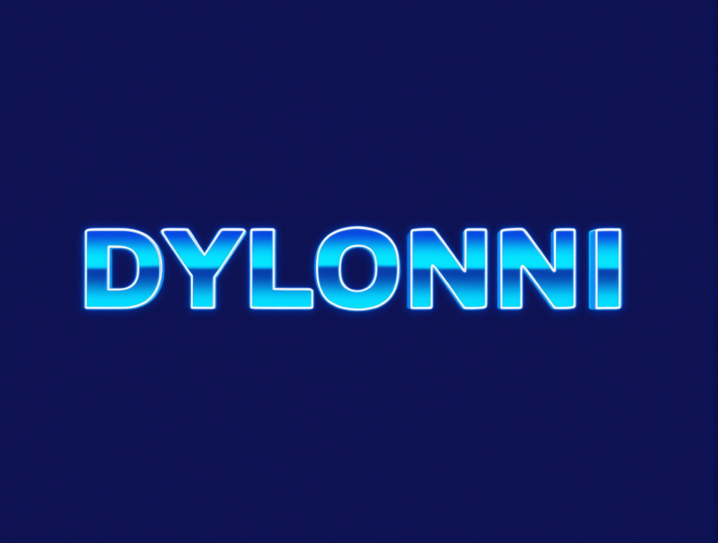
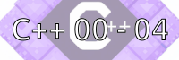
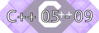

<!--
**Dylonni/Dylonni** is a ✨ _special_ ✨ repository because its `README.md` (this file) appears on your GitHub profile.

Here are some ideas to get you started:

- 🔭 I’m currently working on ...
- 🌱 I’m currently learning ...
- 👯 I’m looking to collaborate on ...
- 🤔 I’m looking for help with ...
- 💬 Ask me about ...
- 📫 How to reach me: ...
- 😄 Pronouns: ...
- ⚡ Fun fact: ...
-->

# Welcome to my github page !

Here you can see my projects, mainly done during my journey at 42 School.  
There are also some personal side projects, feel free to check them out !  
Lasty, here is a link to my [portfolio](https://dylonni.me) if you want to contact me or see about my personal experiences. I will (C) you Around :)

## Languages and Technical stack ⚡  

There are the technologies i have been using so far, amongst some others ! 

### Dev Languages

    
    
    
    
    
    

### Dev Environment

 
    
    
    
    
    

### DevOps Tools and Deployment

 
    
    
    
    
    
    

### Web Development

 
    
    
    
    
    
    
    

## 42 Common Core Projects

  

 

## 42 Advanced Projects (Specialization)

